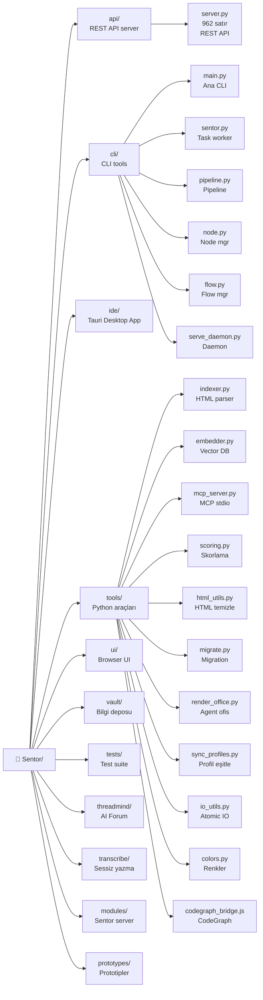
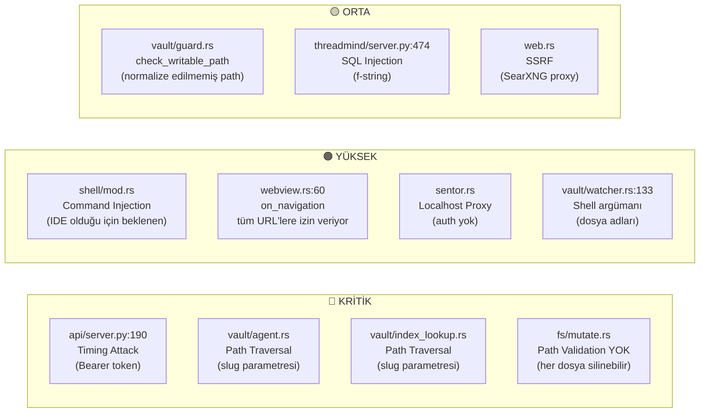
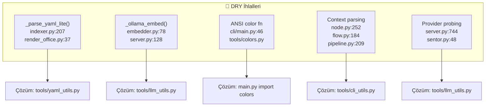

# Sentor — Kapsamlı Kod Analiz Raporu

**Tarih:** 28 Mayıs 2026
**Toplam dosya:** ~300+ (Python, TypeScript, Rust, HTML, CSS, JS, JSON)
**Ana dil:** İngilizce (Türkçe/Endonezce karışık yorumlar)
**AI-generated oranı:** ~%85-90

---

## 1. MİMARİ GENEL BAKIŞ

```mermaid
graph TB
    subgraph Python_Backend["Python Backend (stdlib)"]
        CLI["cli/main.py<br/>Ana CLI"]
        API["api/server.py<br/>REST API (port 4242)"]
        MCP["tools/mcp_server.py<br/>MCP stdio Server"]
        INDEXER["tools/indexer.py<br/>Vault Indexer"]
        EMBEDDER["tools/embedder.py<br/>Semantic Embedder"]
        SCORING["tools/scoring.py<br/>Shared Scoring"]
    end

    subgraph IDE["IDE Desktop (Tauri v2)"]
        RUST["ide/src-tauri/<br/>Rust Backend"]
        TS["ide/src/<br/>TypeScript/React"]
        UI_LIB["ide/src/components/ui/<br/>shadcn Bileşenleri"]
    end

    subgraph WebUI["Web UI"]
        UI_INDEX["ui/index.html + app.js<br/>Fuse.js Arama"]
        UI_CTRL["ui/control.html<br/>API-based UI"]
    end

    subgraph Vault["Vault (Bilgi Deposu)"]
        VAULT["vault/{cat}/{slug}/index.html<br/>50 HTML sayfa"]
        INDEX_FILES[".index/pages.json<br/>.index/pages.js<br/>.index/embeddings.json"]
    end

    subgraph Tools["Yardımcı Araçlar"]
        SENTOR["cli/sentor.py<br/>Task Worker"]
        PIPELINE["cli/pipeline.py<br/>Pipeline Runner"]
        NODE["cli/node.py<br/>Node Manager"]
        FLOW["cli/flow.py<br/>Flow Manager"]
        TRANS["transcribe/server.py<br/>Whisper API"]
        SYNCPROF["tools/sync_profiles.py"]
        RENOFF["tools/render_office.py"]
        MIGRATE["tools/migrate.py"]
    end

    subgraph External["Harici Servisler"]
        OLLAMA["Ollama<br/>(all-minilm, LLM)"]
        LMSTUDIO["LM Studio<br/>(Local LLM)"]
        SEARXNG["SearXNG<br/>(Web Search)"]
    end

    CLI --> API
    CLI --> INDEXER
    CLI --> EMBEDDER
    CLI --> SENTOR
    API --> INDEX_FILES
    API --> OLLAMA
    MCP --> VAULT
    TS --> RUST
    RUST --> VAULT
    RUST --> INDEX_FILES
    TS --> LMSTUDIO
    TS --> OLLAMA
    UI_INDEX --> INDEX_FILES
    UI_CTRL --> API
    EMBEDDER --> OLLAMA
    SENTOR --> OLLAMA
```



---

## 2. KLASÖR YAPISI VE AMAÇLARI



| Klasör | Amaç | Kalite |
|--------|------|--------|
| `api/` | REST API (port 4242), hybrid search, auth, CLI bridge | 7.5/10 |
| `cli/` | 6 CLI modülü: main, sentor, pipeline, node, flow, serve_daemon | 7.5/10 |
| `ide/` | Tauri v2 desktop app (Rust + TypeScript/React) | Rust: 7.5/10, TS: 7.5/10 |
| `tools/` | 11 Python/JS aracı (indexer, embedder, MCP, scoring...) | 8.5/10 |
| `ui/` | Browser UI (index.html Fuse.js + control.html API) | 9/10 |
| `vault/` | 50 HTML sayfa bilgi deposu | 8/10 |
| `tests/` | 3 test dosyası (API, Ollama, Multiturn) | 8/10 |
| `threadmind/` | AI forum server (FastAPI) — zero-deps ihlali | 6/10 |
| `transcribe/` | Whisper mikroservis (Flask) | 9/10 |
| `modules/` | Sentor server (Flowise-compatible) | 8/10 |
| `prototypes/` | Alakasız AI prototipleri — **silinebilir** | 5/10 |

---

## 3. DOSYA DOSYA ANALİZ

### 3.1 Python Backend (stdlib)

#### ✅ En İyi Python Dosyaları

| Dosya | Puan | Neden |
|-------|:----:|-------|
| `tools/scoring.py` | **9/10** | 46 satır, tek sorumluluk, frozenset, zero-division koruması |
| `tools/colors.py` | **9/10** | 42 satır, TTY detection, minimal ve yeterli |
| `tools/html_utils.py` | **9/10** | 27 satır, optimize regex pipeline, html.unescape |
| `tools/io_utils.py` | **8.5/10** | Atomic write, secure token, chmod(0o600) |
| `tools/mcp_server.py` | **8.5/10** | JSON-RPC 2.0, atomic queue, path traversal koruması, UTF-8 reconfigure |

#### ❌ En Problemli Python Dosyaları

| Dosya | Puan | Sorunlar |
|-------|:----:|----------|
| `threadmind/server.py` | **6/10** | FastAPI bağımlılığı, SQL injection (satır 474), connection pooling yok, 0 test |
| `prototypes/tlas/index.html` | **5/10** | Projeyle alakasız, %100 AI-generated |
| `prototypes/taslak/index.html` | **7/10** | Projeyle alakasız 10 tasarım prototipi |
| `cli/sentor.py` | **7/10** | **Endonezce karışmış** (`jika` = Endonezce "if"), Türkçe yorumlar |
| `api/server.py` | **7.5/10** | **Timing attack açığı** (satır 190, 192), 112 satırlık `_hybrid` metodu |

### 3.2 IDE Rust Backend

#### ✅ En İyi Rust Dosyaları

| Dosya | Puan | Neden |
|-------|:----:|-------|
| `pty/session.rs` | **9.5/10** | Profesyonel PTY pipeline (Reader→Flusher→Waiter), overflow handling, SGR-reset |
| `pty/shell_init.rs` | **9/10** | Multi-shell detection (Zsh/Bash/Fish/PowerShell), atomic init scripts |
| `shell/ringbuffer.rs` | **9/10** | VecDeque bounded buffer, offset-based tailing, clean API |
| `fs/grep.rs` | **9/10** | Parallel grep (grep-searcher), binary detection, 5MB cap |
| `secrets.rs` | **9/10** | Platform-native keyring + atomic Linux fallback, batch read |
| `input/subclass.rs` | **9/10** | Win32 WindowProc subclass, lock-free bitmap read |
| `pty/job.rs` | **8.5/10** | Win32 Job Object, KILL_ON_JOB_CLOSE, safe HANDLE Send+Sync |

#### ❌ En Problemli Rust Dosyaları

| Dosya | Puan | Sorunlar |
|-------|:----:|----------|
| `ai_local/mod.rs` | **3/10** | "Bu bir taslaktır" — dummy sabitler, derlenmeyen modül |
| `db/mod.rs` | **6/10** | Türkçe yorumlar, AI-generated kokusu, `lib.rs`'te kullanılmıyor |
| `vault/agent.rs` | **7/10** | Path traversal açığı (`slug` doğrulanmıyor), Türkçe placeholder |
| `vault/index_lookup.rs` | **7/10** | Path traversal: `slug = "../../etc/passwd"` çalışır |
| `fs/mutate.rs` | **6/10** | **Hiç path validation yok**, her dosya silinebilir |
| `sentor.rs` | **7/10** | Auth'suz localhost proxy — SSRF riski |
| `vault/guard.rs` | **7/10** | `check_writable_path` normalize edilmemiş path ile atlatılabilir |

### 3.3 IDE TypeScript/React Frontend

#### ✅ En İyi TypeScript Dosyaları

| Modül | Puan | Neden |
|-------|:----:|-------|
| `ai/lib/security.ts` | **9/10** | Path security guard, secret scanning, dangerous command detection |
| `canvas/canvasEngine.ts` | **9/10** | Kahn BFS topological execution, gate blocking, clean pipeline |
| `canvas/types.ts` | **9/10** | 30 PanelType, Connection/WireData, clean type definitions |
| `canvas/variableStore.ts` | **8.5/10** | Zustand + LazyStore, 400ms debounced flush |
| `ai/tools/orchestration.ts` | **8.5/10** | Inter-agent delegation, read-only mode |

#### ❌ En Problemli TypeScript Dosyaları

| Modül | Puan | Sorunlar |
|-------|:----:|----------|
| `canvas/canvasStore.ts` | **7/10** | 682 satır — çok büyük, global timers |
| `ai/tools/vault.ts` | **7/10** | ~743 satır — en büyük tool, çok sorumluluk |
| `v3-canvas/V3SecondaryCanvas.tsx` | **6/10** | V3InfiniteCanvas'ın neredeyse birebir kopyası (~200 satır duplicated) |
| `ai/store/chatStore.ts` | **7/10** | 524 satır, per-session caching karmaşık |

---

## 4. KRİTİK GÜVENLİK AÇIKLARI



---

## 5. PERFORMANS SORUNLARI

| # | Dosya | Sorun | Etki |
|---|-------|-------|------|
| 1 | `Rust/shell/background.rs` | Her `shell_bg_spawn` 3 thread açar, thread pool yok | 100+ process → thread patlaması |
| 2 | `Rust/pty/session.rs` | Her `pty_open` 3 thread açar | Aynı sorun |
| 3 | `Rust/fs/tree.rs` | `fs_read_dir` senkron, `spawn_blocking` yok | UI donabilir |
| 4 | `indexer.py:393` | `rglob("*")` tüm dosyaları dolaşır, filtre sonra | Büyük vault'larda yavaş |
| 5 | `embedder.py:177` | Her sayfa için ayrı Ollama API çağrısı | Batch embedding desteklenmeli |
| 6 | `server.py:352` | Her search'te candidate listesi yeniden oluşur | Büyük index'lerde maliyetli |
| 7 | `mcp_server.py:338` | Her search'te tüm sayfalar skorlanır | 1000+ sayfada yavaş |
| 8 | `canvas/canvasStore.ts` | 682 satır, global timer'lar | Re-render ve memory |

---

## 6. DRY İHLALLERİ (KOD TEKRARI)



---

## 7. DİL TUTARSIZLIKLARI

| Dosya | İçerik | Dil |
|-------|--------|:----:|
| `cli/sentor.py` | Yorumlar, docstring'ler | 🇹🇷 Türkçe |
| `cli/sentor.py:65` | **"jika"** (=Endonezce "if") | 🇮🇩 **Endonezce!** |
| `cli/pipeline.py` | Docstring, değişken isimleri | 🇹🇷🇬🇧 Karışık |
| `cli/node.py` | Docstring | 🇹🇷🇬🇧 Karışık |
| `cli/flow.py` | Docstring | 🇹🇷🇬🇧 Karışık |
| `db/mod.rs` | Yorumlar ("Notlar tablosu") | 🇹🇷 Türkçe |
| `ai_local/mod.rs` | "Bu bir taslaktır" | 🇹🇷 Türkçe |
| `vault/agent.rs` | "(eklenecek)" placeholder | 🇹🇷 Türkçe |
| Proje geneli | Kod, API, değişkenler | 🇬🇧 İngilizce |

---

## 8. "ZERO-DEPS" FELSEFESİ İHLALLERİ

`AGENTS.md`'de "Zero deps (Python): stdlib only" deniyor, ama:

| Modül | Bağımlılıklar | İhlal |
|-------|--------------|:-----:|
| `threadmind/server.py` | FastAPI, uvicorn, Jinja2, Pydantic, httpx | **❌ Evet** |
| `threadmind/cli.py` | rich, typer, httpx | **❌ Evet** |
| `transcribe/server.py` | flask, faster-whisper | **❌ Evet** |
| `ide/` | 55+ npm paketi | **❌ Evet** (beklenen) |
| `api/server.py` | **stdlib only** ✅ | — |
| `cli/main.py` | **stdlib only** ✅ | — |
| `tools/mcp_server.py` | **stdlib only** ✅ | — |
| `tools/indexer.py` | **stdlib only** ✅ | — |
| `tools/embedder.py` | **stdlib only** ✅ | — |
| `modules/sentor-server/` | **stdlib only** ✅ | — |

---

## 9. GEREKSİZ / FAZLALIK DOSYALAR

| Dosya | Neden Gereksiz? |
|-------|-----------------|
| `prototypes/tlas/index.html` | Projeyle alakasız AI karşılaştırması |
| `prototypes/taslak/index.html` | Projeyle alakasız 10 web tasarımı | 
| `ui/control.html` | `ui/index.html` ile çift UI, API'ye bağımlı |
| `sentor-v3.bat` | Dokümante edilmemiş, `sentor.bat` ile örtüşüyor |
| `opencode.json` | `.mcp.json` ile aynı config |
| `tools/common.py` | Deprecated wrapper, yakında silinmeli |
| `vault/logs/*.json` (1.57 MB) | Vault'un %72'si! Gizli dizine taşınmalı |

---

## 10. OPTİMİZASYON ÖNERİLERİ

### 🚨 Acil (Yüksek Öncelik)

1. **Timing Attack Fix** — `api/server.py:190,192`: Token karşılaştırmasını `hmac.compare_digest()` ile değiştir
2. **Path Traversal Fix** — `vault/agent.rs`, `index_lookup.rs`: `slug` parametresini doğrula (`/` ve `..` kontrolü)
3. **Path Validation** — `fs/mutate.rs` tüm dosya işlemlerine izin verilen path kontrolü ekle
4. **SQL Injection Fix** — `threadmind/server.py:474`: f-string → parametrize query

### 📦 DRY Düzeltmeleri (Orta Öncelik)

5. `_parse_yaml_lite` → `tools/yaml_utils.py` (indexer.py + render_office.py)
6. `_ollama_embed` → `tools/llm_utils.py` (embedder.py + server.py)
7. Context parsing (`key=value`) → `tools/cli_utils.py` (node.py + flow.py + pipeline.py)
8. `V3SecondaryCanvas` → `V3InfiniteCanvas` ile birleştir (~200 satır duplicated code)

### 🔧 Performans (Orta Öncelik)

9. `embedder.py` batch embedding: her sayfa için ayrı çağrı yerine `"input"` array kullan
10. `indexer.py:393`: `rglob("*")` → `rglob("*.html")` + `rglob("*.md")`
11. Rust: `spawn_blocking` kullanılmayan FS işlemlerine async wrapper ekle
12. Thread pool: shell/pty background thread'leri için havuz

### 🧹 Temizlik (Düşük Öncelik)

13. `prototypes/` klasörünü sil veya `archive/` altına taşı
14. `ui/control.html`'yi kaldır veya `index.html` ile birleştir
15. `vault/logs/`'u `.index/logs/`'a taşı
16. Dil tutarsızlıklarını düzelt (özellikle "jika" → "if")
17. `opencode.json` ve `.mcp.json`'dan birini kaldır
18. `sentor-v3.bat`'ı dokümante et veya `sentor.bat` ile birleştir
19. `ai_local/mod.rs`'i tamamla veya kaldır
20. `db/mod.rs` kullanılmıyorsa kaldır

---

## 11. KALİTE PUANLARI

```mermaid
xychart-beta
    title "Modül Bazında Kod Kalitesi"
    x-axis ["Python Tools", "CLI", "API", "Rust Backend", "TS Frontend", "Web UI", "Tests", "Threadmind", "Transcribe", "Vault"]
    y-axis "Puan (1-10)" 0 to 10
    bar [8.5, 7.5, 7.5, 7.5, 7.5, 9, 8, 6, 9, 8]
```

### Genel Proje Puanı: **7.6/10**

---

## 12. İYİ YAPILMIŞ ŞEYLER ✅

1. **Zero-dependency Python core**: Indexer, CLI, API, MCP — hepsi stdlib-only, takdire şayan
2. **PTY Pipeline** (Rust): Reader→Flusher→Waiter — profesyonel terminal emülasyonu
3. **Atomic Write pattern**: Her yerde temp→rename, crash-safe yazma garantisi
4. **Win32 WindowProc subclass**: Lock-free bitmap click-through, etkileyici bir native çözüm
5. **BoundedRingBuffer**: Offset-based tailing, monotonic offset — ders kitabı kalitesinde
6. **Secret scanning guard** (`vault/guard.rs`): API key'leri, private key'leri tespit eder
7. **Lazy imports** (`cli/main.py`): 7 farklı modül lazy import, startup hızı için optimize
8. **Batch script'ler** (`sentor.bat`): 268 satır, fonksiyon taklidi, error handling — projenin en iyi dosyası
9. **Web UI** (`ui/style.css` + `app.js`): Sıfır build, Fuse.js, XSS koruması, accessibility
10. **MCP server queue**: Atomic write + rename ile Windows race condition önlemi
11. **Multiple shell support** (`shell_init.rs`): Zsh, Bash, Fish, PowerShell otomatik tespit
12. **Split-view canvas**: V3 dual-window (input bar + output window), Mica efekti
13. **AI agent security**: `check_no_secrets`, `check_writable_path` guard pattern'i
14. **Platform-abstract secrets**: macOS Keychain / Windows Credential Manager / Linux file
15. **Tailwind + shadcn/ui**: Modern, consistent, design system-driven UI

---

## 13. KÖTÜ / PROBLEMLİ ŞEYLER ❌

1. **AI-generated kod kokusu**: Aşırı dokümante edilmiş dosya başlıkları, gereksiz yorumlar, copy-paste fonksiyonlar
2. **Dil kaosu**: İngilizce + Türkçe + **Endonezce** karışımı — AI eğitim verisi artefaktı
3. **Timing attack açığı**: `api/server.py` Bearer token karşılaştırması sabit string ile
4. **Path traversal açıkları**: `vault/` modülünde `slug` doğrulaması yok
5. **threadmind zero-deps ihlali**: FastAPI, Pydantic, Jinja2 — proje felsefesiyle çelişiyor
6. **Prototypes klasörü**: Projeyle alakasız, AI üretimi içerik
7. **Log dosyaları vault'u şişiriyor**: 1.57 MB log = vault'un %72'si
8. **V3SecondaryCanvas kopyası**: `V3InfiniteCanvas` ile ~200 satır duplicated code
9. **Rust'ta test yok**: 0 unit test, 0 integration test
10. **Dökümantasyon yol hataları**: `test_api.py` "tools/test_api.py" diyor, gerçek yol "tests/test_api.py"
11. **`ai_local/mod.rs`**: "Bu bir taslaktır" — yarım kalmış, derlenmeyen modül
12. **Performance bottleneck**: Rust FS işlemleri `spawn_blocking` kullanmıyor, UI donabilir
13. **Thread patlaması**: Her shell/pty spawn 3 thread açar, thread pool yok
14. **Event dispatch**: Rust `lib.rs`'te 40+ Tauri komutu validation yok, her pencereye açık

---

## 14. ÖZET

### Ne İyi?
Projenin core mekaniği (vault, indexing, CLI, API, MCP) **sağlam, temiz ve iyi düşünülmüş**. Rust PTY pipeline'ı profesyonel seviyede. Batch script'ler özenli. Web UI performanslı ve erişilebilir. Zero-dependency Python core'u takdire şayan.

### Ne Kötü?
Proje AI-generated kodun tipik hastalıklarını taşıyor: **dil tutarsızlığı** (İngilizce + Türkçe + Endonezce), **DRY ihlalleri** (aynı fonksiyon 2-3 dosyada), **güvenlik açıkları** (timing attack, path traversal). Rust backend'de **hiç test yok**. `threadmind` zero-deps felsefesini tamamen ihlal ediyor.

### Ne Gereksiz?
`prototypes/`, `ui/control.html`, `sentor-v3.bat`, `opencode.json`, `tools/common.py`, 1.57 MB vault log dosyası, `ai_local/mod.rs` taslağı.

### Ne Optimize Edilmeli?
Batch embedding, `rglob` filter, thread pooling, `spawn_blocking` kullanımı, DRY ihlalleri, V3SecondaryCanvas birleştirme, `_hybrid` metot bölme.

### Genel Kanaat
**Vizyon sahibi, iddialı ve büyük ölçüde başarılı bir proje.** AI ile yazılmış olmasına rağmen çalışıyor, iyi organize edilmiş ve kullanışlı. Kritik güvenlik açıkları acilen kapatılmalı, DRY ihlalleri temizlenmeli ve test coverage artırılmalı. Doğru yatırımla çok daha sağlam bir kod tabanına dönüşebilir.
