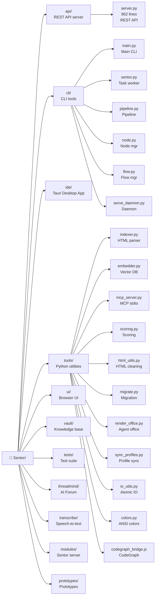
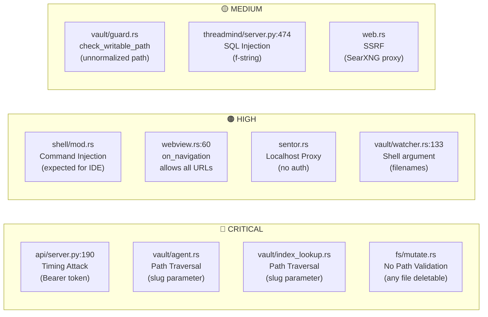
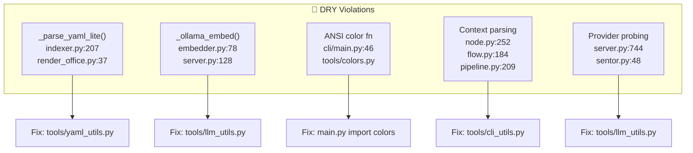

# Sentor — Comprehensive Code Review Report

**Date:** May 28, 2026
**Total files:** ~300+ (Python, TypeScript, Rust, HTML, CSS, JS, JSON)
**Primary language:** English (with Turkish/Indonesian mixed comments)
**AI-generated ratio:** ~85-90%

---

## 1. ARCHITECTURE OVERVIEW

```mermaid
graph TB
    subgraph Python_Backend["Python Backend (stdlib)"]
        CLI["cli/main.py<br/>Main CLI"]
        API["api/server.py<br/>REST API (port 4242)"]
        MCP["tools/mcp_server.py<br/>MCP stdio Server"]
        INDEXER["tools/indexer.py<br/>Vault Indexer"]
        EMBEDDER["tools/embedder.py<br/>Semantic Embedder"]
        SCORING["tools/scoring.py<br/>Shared Scoring"]
    end

    subgraph IDE["IDE Desktop (Tauri v2)"]
        RUST["ide/src-tauri/<br/>Rust Backend"]
        TS["ide/src/<br/>TypeScript/React"]
        UI_LIB["ide/src/components/ui/<br/>shadcn Components"]
    end

    subgraph WebUI["Web UI"]
        UI_INDEX["ui/index.html + app.js<br/>Fuse.js Search"]
        UI_CTRL["ui/control.html<br/>API-based UI"]
    end

    subgraph Vault["Vault (Knowledge Base)"]
        VAULT["vault/{cat}/{slug}/index.html<br/>50 HTML pages"]
        INDEX_FILES[".index/pages.json<br/>.index/pages.js<br/>.index/embeddings.json"]
    end

    subgraph Tools["Utility Tools"]
        SENTOR["cli/sentor.py<br/>Task Worker"]
        PIPELINE["cli/pipeline.py<br/>Pipeline Runner"]
        NODE["cli/node.py<br/>Node Manager"]
        FLOW["cli/flow.py<br/>Flow Manager"]
        TRANS["transcribe/server.py<br/>Whisper API"]
        SYNCPROF["tools/sync_profiles.py"]
        RENOFF["tools/render_office.py"]
        MIGRATE["tools/migrate.py"]
    end

    subgraph External["External Services"]
        OLLAMA["Ollama<br/>(all-minilm, LLM)"]
        LMSTUDIO["LM Studio<br/>(Local LLM)"]
        SEARXNG["SearXNG<br/>(Web Search)"]
    end

    CLI --> API
    CLI --> INDEXER
    CLI --> EMBEDDER
    CLI --> SENTOR
    API --> INDEX_FILES
    API --> OLLAMA
    MCP --> VAULT
    TS --> RUST
    RUST --> VAULT
    RUST --> INDEX_FILES
    TS --> LMSTUDIO
    TS --> OLLAMA
    UI_INDEX --> INDEX_FILES
    UI_CTRL --> API
    EMBEDDER --> OLLAMA
    SENTOR --> OLLAMA
```



---

## 2. FOLDER STRUCTURE & PURPOSE



| Folder | Purpose | Quality |
|--------|---------|:-------:|
| `api/` | REST API (port 4242), hybrid search, auth, CLI bridge | 7.5/10 |
| `cli/` | 6 CLI modules: main, sentor, pipeline, node, flow, serve_daemon | 7.5/10 |
| `ide/` | Tauri v2 desktop app (Rust + TypeScript/React) | Rust: 7.5/10, TS: 7.5/10 |
| `tools/` | 11 Python/JS tools (indexer, embedder, MCP, scoring...) | 8.5/10 |
| `ui/` | Browser UI (index.html Fuse.js + control.html API) | 9/10 |
| `vault/` | 50 HTML page knowledge base | 8/10 |
| `tests/` | 3 test files (API, Ollama, Multiturn) | 8/10 |
| `threadmind/` | AI forum server (FastAPI) — zero-deps violation | 6/10 |
| `transcribe/` | Whisper microservice (Flask) | 9/10 |
| `modules/` | Sentor server (Flowise-compatible) | 8/10 |
| `prototypes/` | Unrelated AI prototypes — **can be deleted** | 5/10 |

---

## 3. FILE-BY-FILE ANALYSIS

### 3.1 Python Backend (stdlib)

#### ✅ Best Python Files

| File | Score | Reason |
|------|:-----:|--------|
| `tools/scoring.py` | **9/10** | 46 lines, single responsibility, frozenset, zero-division guard |
| `tools/colors.py` | **9/10** | 42 lines, TTY detection, minimal and sufficient |
| `tools/html_utils.py` | **9/10** | 27 lines, optimized regex pipeline, html.unescape |
| `tools/io_utils.py` | **8.5/10** | Atomic write, secure token, chmod(0o600) |
| `tools/mcp_server.py` | **8.5/10** | JSON-RPC 2.0, atomic queue, path traversal protection, UTF-8 reconfigure |

#### ❌ Most Problematic Python Files

| File | Score | Issues |
|------|:-----:|--------|
| `threadmind/server.py` | **6/10** | FastAPI dependency, SQL injection (line 474), no connection pooling, 0 tests |
| `prototypes/tlas/index.html` | **5/10** | Unrelated to project, 100% AI-generated |
| `prototypes/taslak/index.html` | **7/10** | Unrelated 10 design prototypes |
| `cli/sentor.py` | **7/10** | **Indonesian mixed in** (`jika` = Indonesian "if"), Turkish comments |
| `api/server.py` | **7.5/10** | **Timing attack vulnerability** (lines 190, 192), 112-line `_hybrid` method |

### 3.2 IDE Rust Backend

#### ✅ Best Rust Files

| File | Score | Reason |
|------|:-----:|--------|
| `pty/session.rs` | **9.5/10** | Professional PTY pipeline (Reader→Flusher→Waiter), overflow handling, SGR-reset |
| `pty/shell_init.rs` | **9/10** | Multi-shell detection (Zsh/Bash/Fish/PowerShell), atomic init scripts |
| `shell/ringbuffer.rs` | **9/10** | VecDeque bounded buffer, offset-based tailing, clean API |
| `fs/grep.rs` | **9/10** | Parallel grep (grep-searcher), binary detection, 5MB cap |
| `secrets.rs` | **9/10** | Platform-native keyring + atomic Linux fallback, batch read |
| `input/subclass.rs` | **9/10** | Win32 WindowProc subclass, lock-free bitmap read |
| `pty/job.rs` | **8.5/10** | Win32 Job Object, KILL_ON_JOB_CLOSE, safe HANDLE Send+Sync |

#### ❌ Most Problematic Rust Files

| File | Score | Issues |
|------|:-----:|--------|
| `ai_local/mod.rs` | **3/10** | "This is a draft" — dummy constants, non-compiling module |
| `db/mod.rs` | **6/10** | Turkish comments, AI-generated smell, unused in `lib.rs` |
| `vault/agent.rs` | **7/10** | Path traversal vulnerability (`slug` not validated), Turkish placeholder |
| `vault/index_lookup.rs` | **7/10** | Path traversal: `slug = "../../etc/passwd"` works |
| `fs/mutate.rs` | **6/10** | **No path validation at all**, any file can be deleted |
| `sentor.rs` | **7/10** | Unauthenticated localhost proxy — SSRF risk |
| `vault/guard.rs` | **7/10** | `check_writable_path` can be bypassed with unnormalized paths |

### 3.3 IDE TypeScript/React Frontend

#### ✅ Best TypeScript Files

| Module | Score | Reason |
|--------|:-----:|--------|
| `ai/lib/security.ts` | **9/10** | Path security guard, secret scanning, dangerous command detection |
| `canvas/canvasEngine.ts` | **9/10** | Kahn BFS topological execution, gate blocking, clean pipeline |
| `canvas/types.ts` | **9/10** | 30 PanelType, Connection/WireData, clean type definitions |
| `canvas/variableStore.ts` | **8.5/10** | Zustand + LazyStore, 400ms debounced flush |
| `ai/tools/orchestration.ts` | **8.5/10** | Inter-agent delegation, read-only mode |

#### ❌ Most Problematic TypeScript Files

| Module | Score | Issues |
|--------|:-----:|--------|
| `canvas/canvasStore.ts` | **7/10** | 682 lines — too large, global timers |
| `ai/tools/vault.ts` | **7/10** | ~743 lines — largest tool, too many responsibilities |
| `v3-canvas/V3SecondaryCanvas.tsx` | **6/10** | Near-identical copy of V3InfiniteCanvas (~200 lines duplicated) |
| `ai/store/chatStore.ts` | **7/10** | 524 lines, complex per-session caching |

---

## 4. CRITICAL SECURITY VULNERABILITIES



---

## 5. PERFORMANCE ISSUES

| # | File | Issue | Impact |
|---|------|-------|--------|
| 1 | `Rust/shell/background.rs` | Each `shell_bg_spawn` spawns 3 threads, no thread pool | 100+ processes → thread explosion |
| 2 | `Rust/pty/session.rs` | Each `pty_open` spawns 3 threads | Same issue |
| 3 | `Rust/fs/tree.rs` | `fs_read_dir` synchronous, no `spawn_blocking` | UI can freeze |
| 4 | `indexer.py:393` | `rglob("*")` traverses all files, filter applied later | Slow on large vaults |
| 5 | `embedder.py:177` | Separate Ollama API call per page | Should support batch embedding |
| 6 | `server.py:352` | Candidate list rebuilt on every search | Expensive for large indexes |
| 7 | `mcp_server.py:338` | All pages scored on every search | Slow with 1000+ pages |
| 8 | `canvas/canvasStore.ts` | 682 lines, global timers | Re-render and memory |

---

## 6. DRY VIOLATIONS (CODE DUPLICATION)



---

## 7. LANGUAGE INCONSISTENCIES

| File | Content | Language |
|------|---------|:--------:|
| `cli/sentor.py` | Comments, docstrings | 🇹🇷 Turkish |
| `cli/sentor.py:65` | **"jika"** (=Indonesian "if") | 🇮🇩 **Indonesian!** |
| `cli/pipeline.py` | Docstring, variable names | 🇹🇷🇬🇧 Mixed |
| `cli/node.py` | Docstring | 🇹🇷🇬🇧 Mixed |
| `cli/flow.py` | Docstring | 🇹🇷🇬🇧 Mixed |
| `db/mod.rs` | Comments ("Notlar tablosu") | 🇹🇷 Turkish |
| `ai_local/mod.rs` | "Bu bir taslaktır" (This is a draft) | 🇹🇷 Turkish |
| `vault/agent.rs` | "(eklenecek)" placeholder | 🇹🇷 Turkish |
| Project-wide | Code, API, variables | 🇬🇧 English |

---

## 8. "ZERO-DEPS" PHILOSOPHY VIOLATIONS

`AGENTS.md` states "Zero deps (Python): stdlib only", but:

| Module | Dependencies | Violation |
|--------|-------------|:---------:|
| `threadmind/server.py` | FastAPI, uvicorn, Jinja2, Pydantic, httpx | **❌ Yes** |
| `threadmind/cli.py` | rich, typer, httpx | **❌ Yes** |
| `transcribe/server.py` | flask, faster-whisper | **❌ Yes** |
| `ide/` | 55+ npm packages | **❌ Yes** (expected) |
| `api/server.py` | **stdlib only** ✅ | — |
| `cli/main.py` | **stdlib only** ✅ | — |
| `tools/mcp_server.py` | **stdlib only** ✅ | — |
| `tools/indexer.py` | **stdlib only** ✅ | — |
| `tools/embedder.py` | **stdlib only** ✅ | — |
| `modules/sentor-server/` | **stdlib only** ✅ | — |

---

## 9. UNNECESSARY / REDUNDANT FILES

| File | Reason |
|------|--------|
| `prototypes/tlas/index.html` | Unrelated AI comparison page |
| `prototypes/taslak/index.html` | Unrelated 10 web design prototypes | 
| `ui/control.html` | Duplicate UI with `ui/index.html`, API-dependent |
| `sentor-v3.bat` | Undocumented, overlaps with `sentor.bat` |
| `opencode.json` | Same config as `.mcp.json` |
| `tools/common.py` | Deprecated wrapper, should be removed |
| `vault/logs/*.json` (1.57 MB) | 72% of vault! Move to hidden directory |

---

## 10. OPTIMIZATION RECOMMENDATIONS

### 🚨 Critical (High Priority)

1. **Timing Attack Fix** — `api/server.py:190,192`: Replace token comparison with `hmac.compare_digest()`
2. **Path Traversal Fix** — `vault/agent.rs`, `index_lookup.rs`: Validate `slug` parameter (`/` and `..` checks)
3. **Path Validation** — `fs/mutate.rs`: Add allowed-path checks to all file operations
4. **SQL Injection Fix** — `threadmind/server.py:474`: Replace f-string with parameterized query

### 📦 DRY Fixes (Medium Priority)

5. `_parse_yaml_lite` → `tools/yaml_utils.py` (indexer.py + render_office.py)
6. `_ollama_embed` → `tools/llm_utils.py` (embedder.py + server.py)
7. Context parsing (`key=value`) → `tools/cli_utils.py` (node.py + flow.py + pipeline.py)
8. `V3SecondaryCanvas` → Merge with `V3InfiniteCanvas` (~200 lines duplicated code)

### 🔧 Performance (Medium Priority)

9. `embedder.py` batch embedding: use `"input"` array instead of per-page calls
10. `indexer.py:393`: Replace `rglob("*")` with `rglob("*.html")` + `rglob("*.md")`
11. Rust: Add `spawn_blocking` wrappers to synchronous FS operations
12. Thread pool: Create pool for shell/pty background threads

### 🧹 Cleanup (Low Priority)

13. Remove `prototypes/` or move to `archive/`
14. Remove `ui/control.html` or merge with `index.html`
15. Move `vault/logs/` to `.index/logs/`
16. Fix language inconsistencies (especially "jika" → "if")
17. Remove one of `opencode.json` or `.mcp.json`
18. Document `sentor-v3.bat` or merge with `sentor.bat`
19. Complete or remove `ai_local/mod.rs`
20. Remove `db/mod.rs` if unused

---

## 11. QUALITY SCORES

```mermaid
xychart-beta
    title "Module Quality Scores"
    x-axis ["Python Tools", "CLI", "API", "Rust Backend", "TS Frontend", "Web UI", "Tests", "Threadmind", "Transcribe", "Vault"]
    y-axis "Score (1-10)" 0 to 10
    bar [8.5, 7.5, 7.5, 7.5, 7.5, 9, 8, 6, 9, 8]
```

### Overall Project Score: **7.6/10**

---

## 12. WHAT'S DONE WELL ✅

1. **Zero-dependency Python core**: Indexer, CLI, API, MCP — all stdlib-only, commendable
2. **PTY Pipeline** (Rust): Reader→Flusher→Waiter — professional terminal emulation
3. **Atomic Write pattern**: Temp→rename everywhere, crash-safe write guarantee
4. **Win32 WindowProc subclass**: Lock-free bitmap click-through, impressive native solution
5. **BoundedRingBuffer**: Offset-based tailing, monotonic offset — textbook quality
6. **Secret scanning guard** (`vault/guard.rs`): Detects API keys, private keys
7. **Lazy imports** (`cli/main.py`): 7 modules lazy-imported, optimized startup
8. **Batch scripts** (`sentor.bat`): 268 lines, simulated functions, error handling — best file in project
9. **Web UI** (`ui/style.css` + `app.js`): Zero build, Fuse.js, XSS protection, accessibility
10. **MCP server queue**: Atomic write + rename prevents Windows race conditions
11. **Multiple shell support** (`shell_init.rs`): Auto-detects Zsh, Bash, Fish, PowerShell
12. **Split-view canvas**: V3 dual-window (input bar + output window), Mica effect
13. **AI agent security**: `check_no_secrets`, `check_writable_path` guard patterns
14. **Platform-abstract secrets**: macOS Keychain / Windows Credential Manager / Linux file
15. **Tailwind + shadcn/ui**: Modern, consistent, design system-driven UI

---

## 13. WHAT'S WRONG ❌

1. **AI-generated code smell**: Over-documented file headers, unnecessary comments, copy-paste functions
2. **Language chaos**: English + Turkish + **Indonesian** mixture — AI training data artifact
3. **Timing attack vulnerability**: `api/server.py` Bearer token comparison uses plain string equality
4. **Path traversal vulnerabilities**: No `slug` validation in `vault/` module
5. **threadmind zero-deps violation**: FastAPI, Pydantic, Jinja2 — contradicts project philosophy
6. **Prototypes folder**: Unrelated AI-generated content
7. **Log files bloating vault**: 1.57 MB logs = 72% of vault
8. **V3SecondaryCanvas duplication**: ~200 lines duplicated from `V3InfiniteCanvas`
9. **Zero Rust tests**: 0 unit tests, 0 integration tests
10. **Documentation path errors**: `test_api.py` says "tools/test_api.py", actual path is "tests/test_api.py"
11. **`ai_local/mod.rs`**: "This is a draft" — unfinished, non-compiling module
12. **Performance bottleneck**: Rust FS operations don't use `spawn_blocking`, can freeze UI
13. **Thread explosion**: Each shell/pty spawn opens 3 threads, no thread pool
14. **Event dispatch**: Rust `lib.rs` exposes 40+ Tauri commands without validation, open to all windows

---

## 14. SUMMARY

### What's Good?
The project's core mechanics (vault, indexing, CLI, API, MCP) are **solid, clean, and well-thought-out**. The Rust PTY pipeline is professional-grade. Batch scripts are meticulous. The Web UI is performant and accessible. The zero-dependency Python core is commendable.

### What's Bad?
The project carries typical AI-generated code diseases: **language inconsistency** (English + Turkish + Indonesian), **DRY violations** (same function in 2-3 files), **security vulnerabilities** (timing attack, path traversal). The Rust backend has **zero tests**. `threadmind` completely violates the zero-deps philosophy.

### What's Unnecessary?
`prototypes/`, `ui/control.html`, `sentor-v3.bat`, `opencode.json`, `tools/common.py`, 1.57 MB vault log files, `ai_local/mod.rs` draft.

### What Needs Optimization?
Batch embedding, `rglob` filter, thread pooling, `spawn_blocking` usage, DRY violations, V3SecondaryCanvas merge, `_hybrid` method decomposition.

### Final Verdict
**A visionary, ambitious, and largely successful project.** Despite being AI-generated, it works, is well-organized, and is functional. Critical security vulnerabilities must be fixed urgently, DRY violations cleaned up, and test coverage increased. With the right investments, this could become a much more robust codebase.
